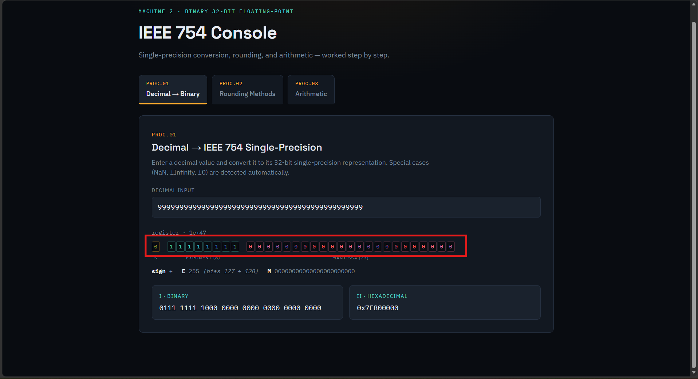
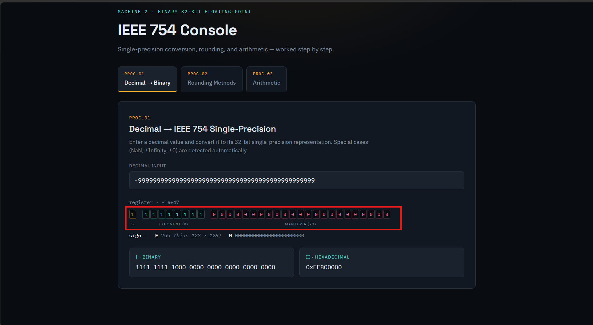
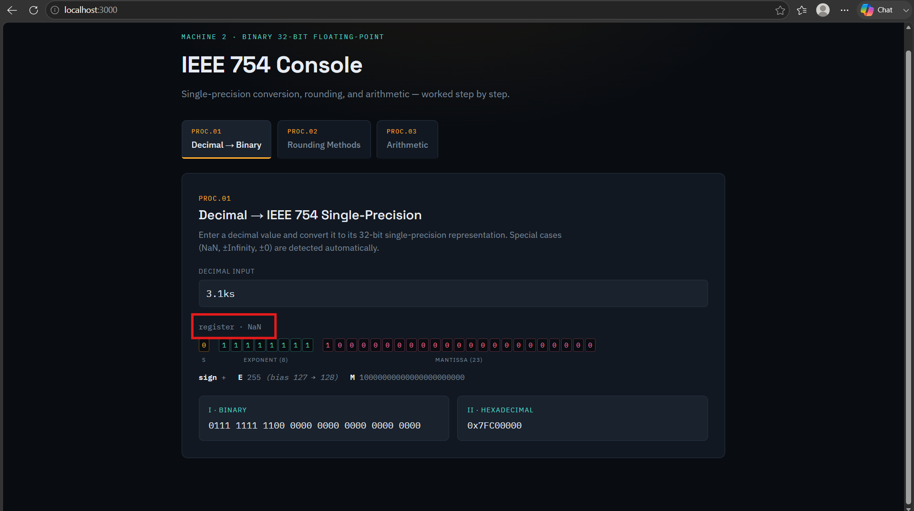
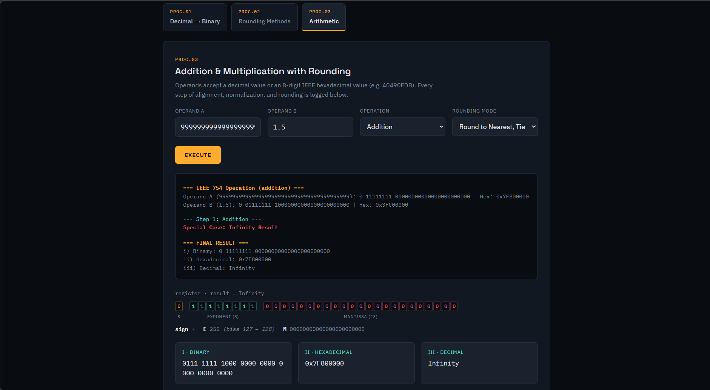
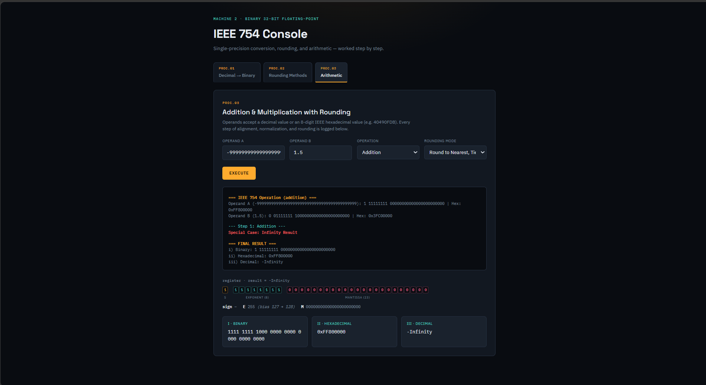

# Machine 2: Binary 32-bit Floating-Point Machine 
CSARCH2 - S01 Project Proposal
Group 2: Justin Ice David, Gian Lorenzo Ortha, Linus Carl Perdon, Neil Justine Tan, Khyle Villorente

# YouTube Demo Link
[https://www.youtube.com/watch?v=gv0ugn_3nUA](https://www.youtube.com/watch?v=gv0ugn_3nUA)

# About the Machine
This machine is a simulation of various operations on single precision floating point numbers, based on the specifications IEEE 754. This machine is able to support the following floating point operations:
- Conversion of a decimal number to its IEEE 754 single precision floating point equivalent
- Floating point rounding methods (truncate, round up, round down, round to nearest ties to even)
- Floating point arithmetic (addition and multiplication)

## How to use this machine
The webpage includes three tabs for each of the respective operations.

1. Decimal to Floating Point Conversion
    1. Place a decimal number into the input box.
    2. The result will be immediately update below showing both the binary and hexadecimal representations of the floating point number.
    3. The input can handle special cases i.e. ±Infinity, denormalized forms, NaN (see [Test Cases](#test-cases))
2. Rounding methods
    1. Select the input format from the dropdown (binary or decimal)
    2. Input the desired number to perform rounding on
    3. Input the amount of target digits. This counts ALL digits before and after the radix point. This does not *only* count the digits after the radix point.
    4. The resulting number will automatically be displayed below with each respective rounding method.
    5. The input can handle both positive and negative numbers and invalid inputs (see [Test Cases](#test-cases))
3. Floating point arithmetic
    1. Place the two operands in each of the input boxes.
    2. Select the desired operation from the dropdown (addition or multiplication)
    3. Select the intermediate rounding method to use (round to nearest ties to even, truncate, round down, round up)
    4. Click execute to perform the operation. The addition/multiplication process is displayed step by step below, and the final output is displayed in binary, hexadecimal, and decimal
    5. The input can handle positive and negative numbers, infinity, and NaN (see [Test Cases](#test-cases))

# Test Cases

## 1. Format Conversions

### Decimal to IEEE 754 Binary (`convertDec2BinFPSP`)
| Test Description / Category | Input Value | Expected Binary Output | Notes |
| :--- | :--- | :--- | :--- |
| Special: NaN | `NaN` | `0111 1111 1100 0000 0000 0000 0000 0000` | Standard NaN bit pattern |
| Special: +Infinity | `Infinity` | `0111 1111 1000 0000 0000 0000 0000 0000` | Pos. Overflow / Inf pattern |
| Special: -Infinity | `-Infinity` | `1111 1111 1000 0000 0000 0000 0000 0000` | Neg. Overflow / Inf pattern |
| Special: Zero | `0` | `0000 0000 0000 0000 0000 0000 0000 0000` | Positive Zero |
| Special: Zero | `-0` | `1000 0000 0000 0000 0000 0000 0000 0000` | Negative Zero |
| PS Q1: Exponent Overflow | `1.8125 * 2^135` | `0111 1111 1000 0000 0000 0000 0000 0000` | Exponent (135 > 127) overflows to +Infinity |
| PS Q3: Denormalized | `1.8125 * 2^-135` | `0000 0000 0000 0000 0111 0100 0000 0000` | Exponent (-135 < -126) shifts radix point |
| PS Q5 Reverse | `-24.25` | `1100 0001 1100 0010 0000 0000 0000 0000` | Exact bit representation |
| Edge Magnitudes | `[0.25, 0.125, 4, 8, 16]` | Matches Float32 Array buffer value | Round-trips fractional powers of 2 |

#### Special Case: Positive Overflow → +Infinity

An input too large for single precision (`9.99…e46`) saturates to `+Infinity`: sign `0`, exponent field all ones (E = 255), mantissa all zeros.



#### Special Case: Negative Overflow → −Infinity

The same magnitude with a negative sign saturates to `-Infinity`: sign `1`, E = 255, mantissa all zeros.



#### Special Case: Invalid Input → NaN

A malformed decimal input (`3.1ks`) is detected and represented as a quiet NaN: E = 255 with a non-zero mantissa.



### Decimal to IEEE 754 Hexadecimal (`convertDec2HexFPSP`)
| Test Description / Category | Input Value | Expected Hex Output | Notes |
| :--- | :--- | :--- | :--- |
| Special: NaN | `NaN` | `7FC00000` | Single-precision NaN |
| Special: +Infinity | `Infinity` | `7F800000` | Single-precision +Inf |
| Special: -Infinity | `-Infinity` | `FF800000` | Single-precision -Inf |
| Special: +0 | `0` | `00000000` | Positive zero hex |
| Special: -0 | `-0` | `80000000` | Negative zero hex |
| PS Q1: Exponent Overflow | `1.8125 * 2^135` | `7F800000` | Overflow to +Infinity |
| PS Q3: Denormalized | `1.8125 * 2^-135` | `00007400` | Denormalized hex representation |
| PS Q5: Decimal Conversion | `-24.25` | `C1C20000` | S=1, e'=131, significand=1.100001_2 |

---

## 2. Magnitude & Rounding Helpers

### Magnitude Increment (`addOneToMagnitude`)
| Input String | Is Binary? | Expected Output | Behavior Description |
| :--- | :--- | :--- | :--- |
| `'1.100'` | `true` | `'1.101'` | Binary increment without carry propagation |
| `'1.111'` | `true` | `'10.000'` | Binary increment with carry propagation |
| `'3.14'` | `false` | `'3.15'` | Decimal increment without carry propagation |
| `'9.99'` | `false` | `'10.00'` | Decimal increment with carry propagation |
| `'999'` | `false` | `'1000'` | Integer-only decimal increment |

### Rounding Method Demonstrations (`demonstrateRoundingMethods`)
| Target Context | Input Value | Is Binary? | Target Digits | Chopping | Round Up | Round Down | Ties to Even |
| :--- | :--- | :--- | :--- | :--- | :--- | :--- | :--- |
| **PS Q1 (a)** | `-1.86855` | `false` | 4 (3 frac) | `-1.868` | `-1.868` | `-1.869` | `-1.869` |
| **PS Q1 (b)** | `-1.86855` | `false` | 3 (2 frac) | `-1.86` | `-1.86` | `-1.87` | `-1.87` |
| **PS Q2 (a)** | `-1.011100` | `true` | 4 (3 frac) | `-1.011` | `-1.011` | `-1.100` | `-1.100` |
| **PS Q2 (b)** | `-1.011100` | `true` | 3 (2 frac) | `-1.01` | `-1.01` | `-1.10` | `-1.10` |

#### Invalid Input Handling

When the value does not match the selected input format — here `2.31` entered as **binary** — the machine flags the input and every rounding method returns NaN.


## 3. Arithmetic Operations (`performOperation`)

### Basic & Special Arithmetic
| Category / Suite | Operation | Input A | Input B | Mode / Setting | Expected Output | Notes / Validation |
| :--- | :--- | :--- | :--- | :--- | :--- | :--- |
| **Addition** | Addition | `9.726542319e15` | `8.8736373412e13` | `tiesToEven` | `9815278024130560` (Decimal)<br>`5A0B7BC6` (Hex) | Binary matches `^[01] [01]{8} [01]{23}$` pattern. |
| **Multiplication** | Multiplication | `0.5` | `-0.4375` | `tiesToEven` | `-0.21875` (Decimal)<br>`BE600000` (Hex) | Exponent step contains `126 + 125 - 127 = 124`; Sign bit starts with `1`. |
| **Multiplication** | Multiplication | `0.5` | `0.4375` | `tiesToEven` | `0.21875` (Decimal) | Sign bit starts with `0`. |
| **Remainder Rounding** | Addition | `407FFFFF` | `407FFFFF` | `chopping` | `7.999999046325684` / `40FFFFFE` | Truncates exact remainder. |
| **Remainder Rounding** | Addition | `407FFFFF` | `407FFFFF` | `roundDown` | `7.999999046325684` / `40FFFFFE` | Matches chopping for positive-sum case. |
| **Remainder Rounding** | Addition | `407FFFFF` | `407FFFFF` | `roundUp` | `8` / `41000000` | Rounds away from truncation. |
| **Remainder Rounding** | Addition | `407FFFFF` | `407FFFFF` | `tiesToEven` | `8` / `41000000` | Resolves tie up (preceding digit is odd). |
| **Scientific Parsing** | Addition | `9.726542319x10^15` | `8.8736373412x10^13` | `tiesToEven` | `9815278024130560` | Tests `x10^` syntax. |
| **Scientific Parsing** | Addition | `9.726542319*10^15` | `8.8736373412*10^13` | `tiesToEven` | `9815278024130560` | Tests `*10^` syntax. |

### Edge & Special Cases (`performOperation`)
| Input A | Input B | Operation | Expected Decimal | Expected Hex |
| :--- | :--- | :--- | :--- | :--- |
| `NaN` | `5` | Addition | `NaN` | `7FC00000` |
| `NaN` | `2` | Multiplication | `NaN` | — |
| `Infinity` | `Infinity` | Addition | `Infinity` | — |
| `Infinity` | `-Infinity` | Addition | `NaN` | — |
| `Infinity` | `5` | Addition | `Infinity` | — |
| `0` | `0` | Addition | `0` | — |
| `5` | `-5` | Addition | `0` | — |
| `0` | `Infinity` | Multiplication | `NaN` | — |
| `Infinity` | `2` | Multiplication | `Infinity` | — |
| `Infinity` | `-2` | Multiplication | `-Infinity` | — |
| `0` | `5` | Multiplication | `0` | — |

#### Special Case: Infinity Result

Adding an overflowing operand (`9.99…e46`, already `+Infinity`) to `1.5` short-circuits to the infinity special case. The step log records the detection, and the final result is reported in binary, hexadecimal (`0x7F800000`), and decimal.



#### Special Case: Negative Infinity Result

The mirrored case, where a negative overflowing operand drives the sum to `-Infinity`.



---

# Tech Stack
This project was primarily made in Typescript, using React as the frontend framework. Rsbuild was used as the react build tool to run the project and to build and deploy it to GitHub Pages.

# How to Run Locally

Start the dev server locally, and the app will be available at [http://localhost:3000](http://localhost:3000).

```bash
npm run dev
```

Run the unit tests locally with the following command:

```bash
npm run test
```
